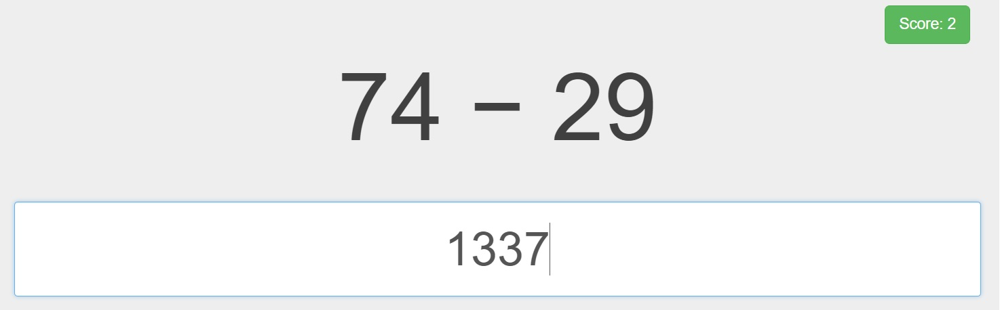

# Arithmetic Game

+ Practice mental arithmetic,
+ Built with Vue.js,
+ Play at: https://qedpi.github.io/Arithmetic-Game-Vue.js/ or http://qedpi.com/game

# Customize Operators & Number of Digits

+ The operator and operands will be randomized for each problem,
+ Click on the operator buttons to enable and disable training with them,
+ Adjust difficulty by changing the minimum & maximum amount of digits,
+ Here, we only want two digit addition / subtraction problems.

# Playing the Game

+ Type the answer, and it'll automatically be accepted, with a bubble-popping sound effect!
+ Type 's' to skip a problem.
+ Score ( problems solved ) shown on top-right. 
